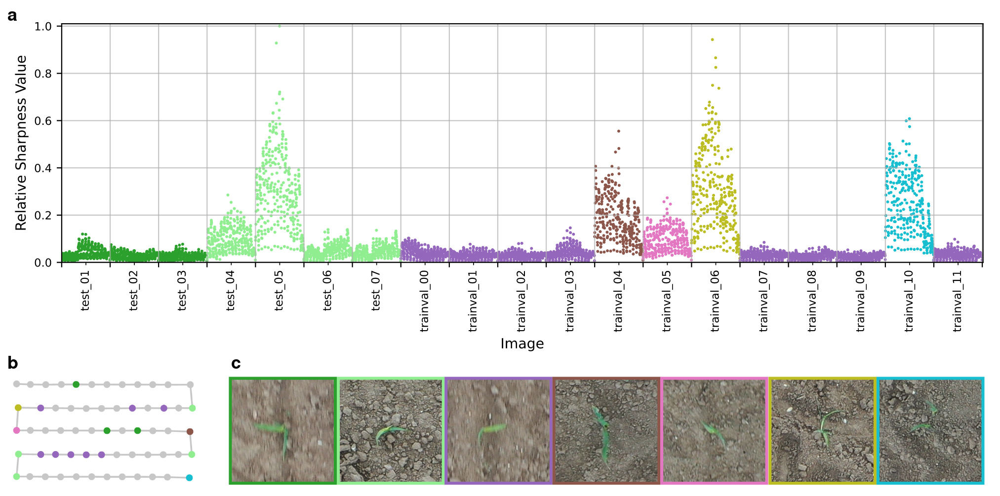
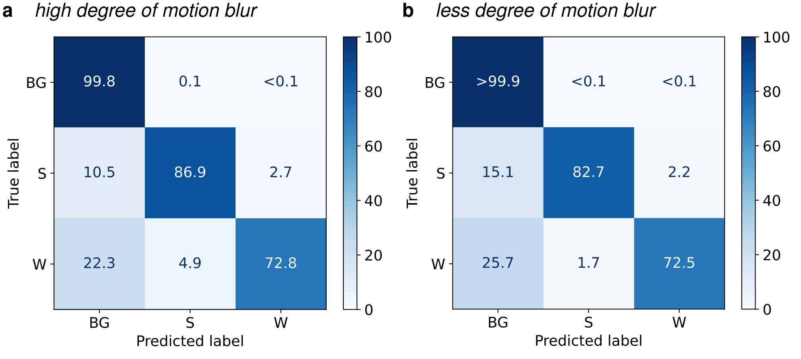
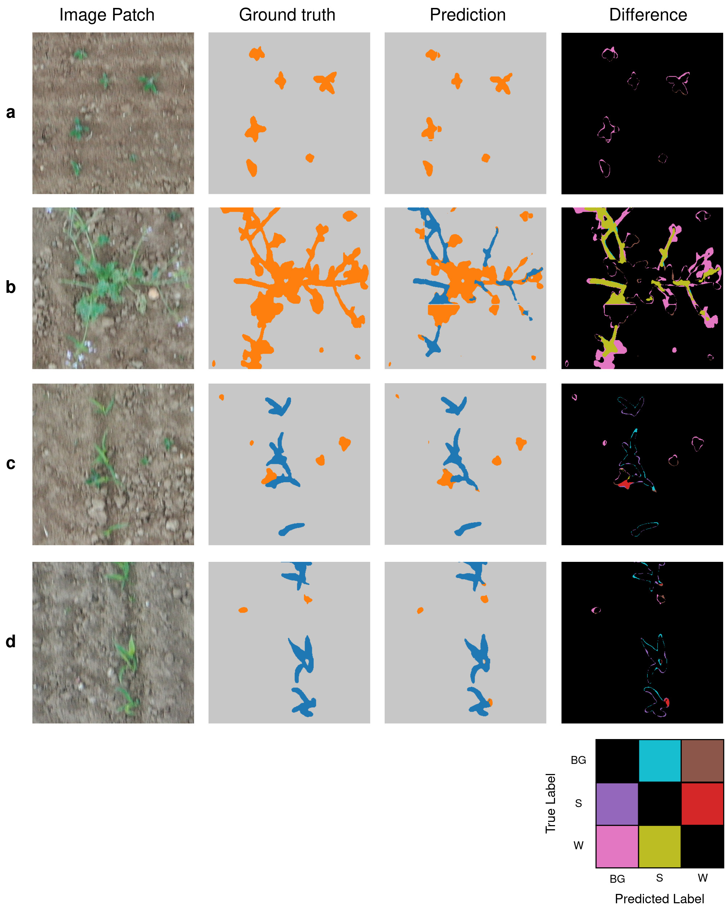

# UAVWeedSegmentation

This repository provides the source code for "Deep Learning-based Early Weed Segmentation using UAV Images of Sorghum Fields". 

<p align="center">
    
</p>

**Figure 1**: Sharpness assessment for the dataset used in this study. The calculated sharpness matches the manual assessment of this dataset, 
as images 04, 05, 06 and 10 from the trainval dataset were relatively 
sharper as the other captures. The test-set captures were degraded 
with different degrees of motion blur with 01, 02 and 03 being blurred 
the most. The color code matches in the sub-figures. **a** Relative 
Sharpness Value based on TVoL. Lower values indicate a higher degree 
of motion blur. Most captures in the dataset were blurred, but there 
were also some relatively sharper images present. **b** Flight plan of the
used dataset showing the location of the captures. Gray dots indicate 
captures that were not annotated. Relatively sharp captures were located
at the edges of the flight plan, where the drone was flying slower 
to rotate, as indicated by the limegreen, brown, pink, yellow and cyan
dots. **c** Example patches from the captures, where color of the border
indicates the corresponding capture.

## Results on the Test-Set
The results of the best performing model (UNet + ResNet-34) are shown. 

### Per-class Metrics

|        class | precision |    recall |  f1-score |   support | 
|-------------:|----------:|----------:|----------:|----------:|
|   Background |     99.80 |     99.93 |     99.86 | 137909280 |
|      Sorghum |     91.58 |     86.10 |     88.76 |   1249145 | 
|         Weed |     87.64 |     72.71 |     79.48 |    574567 |
|    macro avg | **93.01** | **86.25** | **89.37** | 139732992 |
| weighted avg |     99.68 |     99.69 |     99.68 | 139732992 |

### Confusion Matrix
The confusion matrix shows per-class accuracies for Background (BG), Sorghum (S) and Weed (W).
<p align="center">
    
</p>

**Figure 2**: Normalized confusion matrix by support size in percent shows the pixel-based classification results on the hold-out test-set. Background/soil is denoted by BG, sorghum by S and weed by W. **a** Test images with a high degree of motion blur (test_01 to test_03, as indicated in Figure 1). **b** Test images with less degree of motion blur (test_04 to test_07, as indicated in Figure 1).

### Example Predictions
Predictions are based on a hold-out test-set.
<p align="center">
    
</p>

**Figure 3**: Qualitative results on the hold-out test-set. Image patches of size 400x400 pixel² are cropped from each test image to show more details. Background (BG) is colored in gray, sorghum (S) in blue and weed (W) pixels in orange. The difference map shows only the misclassifications between ground truth and prediction. **a-c** Examples with a high degree of motion blur. **a** The general shape of weeds is predicted correctly. **b** Large weed plants that could not be removed before sowing the field. Most pixels are predicted correctly. There are small artifacts visible, which are due to the patching process. **c** Weeds intersecting with sorghum plants were predicted correctly. **d-f** Examples with a low degree of motion blur showing weeds and sorghum plants from different captures. The general shape is predicted correctly. **d** Patch from test_04. **e** Patch from test_05. **f** Patch from test_06. 

## Requirements
- Python 3.8
- PyTorch 1.11.0
- Compatible Graphics Card with CUDA >9 and cuDNN installed

## Installation
1. Clone this project
```
git clone git@github.com:grimmlab/UAVWeedSegmentation.git
```

2. Install requirements
```
cd UAVWeedSegmentation
pip install -r requirements.txt
```
3. Download and install pytorch with GPU support that is compatible with your GPU

4. Download trained model from Mendeley Data (https://doi.org/10.17632/4hh45vkp38.5) and paste the unzipped model in `/models`.
Rename the model to `model_unet_resnet34_dil0_bilin1_retrained.pt` to match the parsing of the script `predict_testset`.
## Predict on new UAV images
Now, we can predict weeds in new UAV images using following script:
```
python3 save_patches.py
python3 predict_testset.py [model_path] [subset]
# example
python3 save_patches.py
python3 predict_testset.py models/model_unet_resnet34_dil0_bilin1_retrained.pt test
```
where:
- model_path is the path to the trained model `.pt` file
- subset is the name of the folder in `/data` to predict on.

## Compare Predictions with Ground Truth
For final evaluation, we compare the models predictions with the Ground Truth of a hold-out test set that was annotated manually by agronomy experts. This script generates Figures 3 and 5 of our paper. These figures are saved in `/results/predictions/<subset>`.

```
python3 compare_predictions.py [subset] [--bbch]
# example for comparing predictions and ground truth on the hold-out test set
python3 compare_predictions.py test
# example for comparing predictions and ground truth on the additional test images
python3 compare_predictions.py test_different_bbch --bbch 15
python3 compare_predictions.py test_different_bbch --bbch 19
```
where:
- subset is the name of the folder in `/data` to predict on.
- bbch is the BBCH stage of the UAV captures. Only used for subset `test_different_bbch` and can be either 15 or 19.


## Train new Models
1. Generate patches from images and annotations
```
python3 save_patches.py
```

2. Train DL Model
```
python3 train.py [architecture] [feature_extractor]
# example
python3 train.py fcn resnet50
```
where:
- architecture is either "fcn8s", "fcn16s", "fcn32s", "unet" or "dlplus"
- feature_extractor is either "resnet18", "resnet34", "resnet50" or "resnet101"
- --replace_stride_with_dilation, if using dilation

## Examine Training Databases
When using the script `train.py`, a database will be saved in `results/` containing all trials in this study. There is an own database for each feature extractor and architecture. The studies trained for the publication are saved in several subfolders in `results/studies` can be examined to select the best model architecture and feature extractor. Therefore, change the path in the script `compare_studies.py`. Additionally, Table 3 of the Paper can be generated using this script.

```
python3 compare_studies.py
```

## Re-train on the complete trainval set
A freshly initialized model will be trained on the complete training and validation set using the best hyperparameters and model architecture. 

```
python3 retrain.py [architecture] [feature_extractor]
# example
python3 retrain.py unet resnet34
```

# Publication and Citation
Deep Learning-based Early Weed Segmentation using Motion Blurred UAV Images of Sorghum Fields  
N Genze, R Ajekwe, Z Güreli, F Haselbeck, M Grieb, DG Grimm  
Computers and Electronics in Agriculture, 2022 (https://doi.org/10.1016/j.compag.2022.107388) 


@article{GENZE2022107388,
title = {Deep learning-based early weed segmentation using motion blurred UAV images of sorghum fields},
journal = {Computers and Electronics in Agriculture},
volume = {202},
pages = {107388},
year = {2022},
issn = {0168-1699},
doi = {https://doi.org/10.1016/j.compag.2022.107388},
url = {https://www.sciencedirect.com/science/article/pii/S0168169922006962},
author = {Nikita Genze and Raymond Ajekwe and Zeynep Güreli and Florian Haselbeck and Michael Grieb and Dominik G. Grimm},
keywords = {Deep learning, Weed detection, Weed segmentation, UAV, Precision agriculture}
}
