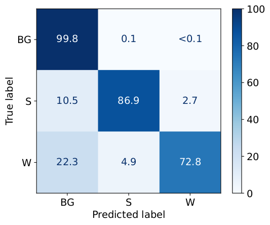

# UAVWeedSegmentation

This repository provides the source code for "Deep Learning-based Early Weed Segmentation using UAV Images of Sorghum Fields". 

## Results on the Test-Set
The results of the best performing model (UNet + ResNet-34) are shown. 

### Per-class Metrics

| class | precision | recall | f1-score | support | 
| -----: | ---------: |-------: | --------: | ------: |
| Background | 99.66 | 99.85 | 99.75 | 58448620 |
| Sorghum | 90.93 | 86.86 | 88.85 | 1018913 | 
| Weed | 86.52 | 72.77 | 79.95 | 418035 |
| macro avg | **92.37** | **86.49** | **89.22** | 59885568 |
| weighted avg | 99.42 | 99.44 | 99.42 | 59885568 |

### Confusion Matrix
The confusion matrix shows per-class accuracies for Background (BG), Sorghum (S) and Weed (W).
<p align="center">
    
</p>


### Example Predictions
Predictions are based on a hold-out test-set.
<p align="center">
    
</p>

## Requirements
- Python 3.8
- PyTorch 1.11.0
- Compatible Graphics Card with CUDA >9 and cuDNN installed

## Installation
1. Clone this project
```
git clone https://github.com/grimmlab/UAVWeedSegmentation.git
```

2. Install requirements
```
cd UAVWeedSegmentation
pip install -r requirements.txt
```
3. Download and install pytorch with GPU support that is compatible with your GPU

4. Download trained model from Mendeley Data (https://doi.org/10.17632/4hh45vkp38.2) and paste the unzipped model in `/models`

## Predict on new UAV images
Now, we can predict weeds in new UAV images using following script:
```
python3 predict_testset.py [model_path] [subset]
# example
python3 predict_testset.py models/model_unet_resnet34.pt test
```
where:
- model_path is the path to the trained model `.pt` file
- subset is the name of the folder in `/data` to predict on.

## Compare Predictions with Ground Truth
For final evaluation, we compare the models predictions with the Ground Truth of a hold-out test set that was annotated manually by agronomy experts. This script generates Figures 3 and 5 of our paper. These figures are saved in `/results/predictions/<subset>`.

```
python3 compare_predictions.py [subset] [--bbch]
# example for comparing predictions and ground truth on the hold-out test set
python3 compare_predictions.py test
# example for comparing predictions and ground truth on the additional test images
python3 compare_predictions.py test_different_bbch --bbch 15
python3 compare_predictions.py test_different_bbch --bbch 19
```
where:
- subset is the name of the folder in `/data` to predict on.
- bbch is the BBCH stage of the UAV captures. Only used for subset `test_different_bbch` and can be either 15 or 19.


## Train new Models
1. Generate patches from images and annotations
```
python3 save_patches.py
```

2. Train DL Model
```
python3 train.py [architecture] [feature_extractor]
# example
python3 train.py fcn resnet50
```
where:
- architecture is either "fcn8s", "fcn16s", "fcn32s", "unet" or "dlplus"
- feature_extractor is either "resnet18", "resnet34", "resnet50" or "resnet101"
- replace_stride_with_dilation is either True or False

## Examine Training Databases
When using the script `train.py`, a database will be saved in `/results` containing all trials in this study. There is an own database for each feature extractor and architecture. These databases can be examined to select the best model architecture and feature extractor. Additionally, Table 3 of the Paper can be generated using this script.

```
python3 compare_studies.py
```

## Re-train on the complete trainval set
A freshly initialized model will be trained on the complete training and validation set using the best hyperparameters and model architecture. 

```
python3 retrain.py [architecture] [feature_extractor]
# example
python3 retrain.py unet resnet34
```
